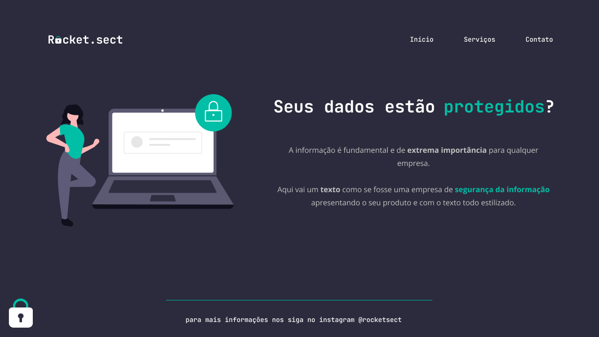

<h1 align="center"> Rocketsect </h1>

Rocketsect 

  <a href="#-tecnologias">Tecnologias</a>&nbsp;&nbsp;&nbsp;|&nbsp;&nbsp;&nbsp;
  <a href="#-projeto">Projeto</a>&nbsp;&nbsp;&nbsp;
  

 

  

## 🚀 Tecnologias

Esse projeto foi desenvolvido com as seguintes tecnologias:

- HTML e CSS
- Git e Github
- Figma

## 💻 Projeto

Ao final do Stage 02 foi proposto um exercício da construção de uma página proposta no Figma, cujo layout se encontra na figura. Aprendemos um pouco mais sobre as tags semânticas.

- [Acesse o projeto finalizado, online](https://viniciuszmota.github.io/Rocketsect)

---

Feito com ♥ by Vinicius Zamprogno Mota, estudante na Rocketseat 👋
